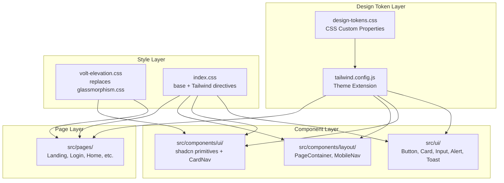

# Design Document: Voltagent Design Adoption

## Overview

This design document outlines the architectural plan for migrating the LinkGuard frontend from its current glassmorphism + gradient aesthetic to the Voltagent dark-canvas, hairline-bordered design system. The migration is purely visual — no component logic, data flow, or page structure changes. The strategy uses a **token-first, component-second, page-third** approach, ensuring that design tokens are established before any component or page is updated.

The core architectural insight is that the Voltagent system does not introduce new behaviors — it replaces existing CSS values, Tailwind utility classes, and component chrome. This makes the migration a **targeted CSS and JSX styling replacement** that can be verified by visual comparison and snapshot updates.

### Key Technologies

- **Frontend**: React 19 (CRA), JavaScript (JSX), Tailwind CSS 3.4
- **Styling Layer**: CSS custom properties (design-tokens.css) → Tailwind config → utility classes → component-specific CSS
- **UI Framework**: shadcn/ui primitives (Radix) + custom components
- **Font Loading**: Google Fonts (Inter, JetBrains Mono replacement)
- **Testing**: @testing-library/react (snapshot tests affected)

### Design Principles

1. **Token-first**: All Voltagent values are defined as CSS custom properties in `design-tokens.css` and extended in `tailwind.config.js` before any component is updated. This ensures a single source of truth.
2. **No behavioral changes**: Every component keeps its existing logic, event handlers, and data flow — only CSS classes and inline styling change.
3. **Preserve semantic risk colors**: The data-driven green/yellow/red risk palette is kept independent of the brand palette.
4. **Incremental replacement, not rewriting**: Each component is updated by replacing Tailwind classes, not by rewriting the component.
5. **Hairlines replace glass**: Every `shadow-*`, `backdrop-blur`, `bg-gradient-*`, and `glass-*` class is mapped to a Voltagent equivalent before removal.

## Architecture

### High-Level Architecture



### Data Flow (Token → Component)

1. CSS custom properties are defined in `design-tokens.css`
2. Tailwind config references these via `tailwind.config.js` theme extension
3. Components consume tokens via Tailwind utility classes (`bg-canvas`, `border-hairline`, `text-ink`)
4. For complex patterns (hover glow, code mockups), component-specific CSS classes are defined in `volt-elevation.css`
5. shadcn HSL variables in `index.css` are updated to output Voltagent equivalents

### Migration Flow per Component

```
IDENTIFY → MAP → REPLACE → VERIFY
   │         │        │         │
   │         │        │         └─ Visual check + snapshot update
   │         │        └─ Replace Tailwind classes with Voltagent equivalents
   │         └─ Map: current classes → Voltagent tokens
   └─ Scan component for: shadow-*, backdrop-blur, glass-*, bg-gradient-*, 
      border-white/*, font-["Space Grotesk"], rounded-*, bg-gray-*, text-gray-*, etc.
```

## Components and Interfaces

### 1. Design Tokens (`src/styles/design-tokens.css`)

**Current**: Cyan/blue brand scale, risk colors, neutral-50–950, JetBrains Mono font variable, 4-token spacing, 5-token radius, shadow tokens, glow tokens

**Target**: Voltagent brand palette, preserved risk/semantic colors, full 11-token spacing system, 5-token radius scale, no shadow tokens

```css
/* New tokens to add */
:root {
  /* Voltagent Brand Colors */
  --color-primary: #00d992;
  --color-primary-soft: #2fd6a1;
  --color-primary-deep: #10b981;
  --color-on-primary: #101010;
  
  /* Surface Colors */
  --color-canvas: #101010;
  --color-canvas-soft: #1a1a1a;
  --color-hairline: #3d3a39;
  --color-hairline-soft: #b8b3b0;
  
  /* Text Colors */
  --color-ink: #f2f2f2;
  --color-ink-strong: #ffffff;
  --color-body: #bdbdbd;
  --color-mute: #8b949e;
  --color-canvas-text-soft: #f5f6f7;
  
  /* Spacing */
  --spacing-xxs: 2px;
  --spacing-xs: 4px;
  --spacing-sm: 8px;
  --spacing-md: 12px;
  --spacing-lg: 16px;
  --spacing-xl: 20px;
  --spacing-2xl: 24px;
  --spacing-3xl: 32px;
  --spacing-4xl: 40px;
  --spacing-5xl: 48px;
  --spacing-6xl: 64px;
  
  /* Radius */
  --radius-none: 0px;
  --radius-xs: 4px;
  --radius-sm: 6px;
  --radius-md: 8px;
  --radius-pill: 9999px;
  
  /* Remove: all shadow-* tokens, glow-* tokens */
}

/* RISK/SEMANTIC COLORS — PRESERVED UNCHANGED */
```

### 2. Tailwind Config (`tailwind.config.js`)

```javascript
// Key additions to theme.extend:
colors: {
  canvas: '#101010',
  'canvas-soft': '#1a1a1a',
  hairline: '#3d3a39',
  'hairline-soft': '#b8b3b0',
  ink: '#f2f2f2',
  'ink-strong': '#ffffff',
  body: '#bdbdbd',
  mute: '#8b949e',
  'canvas-text-soft': '#f5f6f7',
  primary: {
    DEFAULT: '#00d992',
    soft: '#2fd6a1',
    deep: '#10b981',
  },
  'on-primary': '#101010',
  // Preserve risk colors
  // Remove brand-50..950 cyan scale
},
fontSize: {
  'display-xl': ['60px', { lineHeight: '60px', letterSpacing: '-0.65px' }],
  'display-lg': ['36px', { lineHeight: '40px', letterSpacing: '-0.9px' }],
  'display-md': ['24px', { lineHeight: '32px', letterSpacing: '-0.6px' }],
  'display-sm': ['20px', { lineHeight: '28px' }],
  'eyebrow-mono': ['14px', { lineHeight: '20px', letterSpacing: '2.52px' }],
  'eyebrow-uppercase': ['18px', { lineHeight: '28px', letterSpacing: '0.45px' }],
  'body-lg': ['18px', { lineHeight: '28px' }],
  'body-md': ['16px', { lineHeight: '26px' }],
  'body-sm': ['14px', { lineHeight: '20px' }],
  'caption': ['12px', { lineHeight: '16px' }],
  'code': ['13px', { lineHeight: '18px' }],
  'button-md': ['16px', { lineHeight: '24px' }],
},
fontFamily: {
  sans: ['Inter', 'system-ui', '-apple-system', 'sans-serif'],
  mono: ['SFMono-Regular', 'Menlo', 'Monaco', 'Consolas', 'Liberation Mono', 'monospace'],
},
```

### 3. shadcn CSS Variables (`src/index.css`)

```css
/* :root (light) — REMOVE entirely, Voltagent is dark-only */
/* .dark — UPDATE to Voltagent values */
.dark {
  --background: 0 0% 6%;       /* #101010 canvas */
  --foreground: 0 0% 95%;      /* #f2f2f2 ink */
  --card: 0 0% 6%;             /* #101010 */
  --card-foreground: 0 0% 95%;
  --popover: 0 0% 6%;
  --popover-foreground: 0 0% 95%;
  --primary: 162 100% 43%;     /* #00d992 hue */
  --primary-foreground: 0 0% 6%;
  --secondary: 0 0% 10%;       /* #1a1a1a canvas-soft */
  --secondary-foreground: 0 0% 95%;
  --muted: 0 0% 10%;
  --muted-foreground: 0 0% 74%; /* #bdbdbd body */
  --accent: 162 100% 43%;
  --accent-foreground: 0 0% 6%;
  --destructive: 0 84% 60%;
  --destructive-foreground: 0 0% 98%;
  --border: 30 5% 23%;         /* #3d3a39 hairline */
  --input: 30 5% 23%;
  --ring: 162 100% 43%;
  --radius: 0.5rem;
}
```

### 4. UI Primitives (`src/ui/`)

#### Button.jsx
- **Interface**: unchanged (children, className, variant, ...props)
- **Variants replaced**: `{ default, ghost, destructive }` → `{ primary, outline, ghost, pill }`
- **Base classes**: `inline-flex items-center justify-center transition-colors focus:outline-none focus:ring-2 focus:ring-primary`
- **Variant classes**:
  - `primary`: `bg-primary text-on-primary hover:bg-primary-soft rounded-sm px-lg py-md font-button-md`
  - `outline`: `bg-canvas text-ink border border-hairline hover:border-hairline-soft rounded-sm px-lg py-md font-button-md`
  - `ghost`: `bg-transparent text-primary-soft hover:text-primary rounded-sm px-lg py-md font-button-md`
  - `pill`: `bg-canvas text-ink border border-hairline rounded-pill px-md py-xs font-body-sm`

#### Card.jsx
- **Interface**: unchanged
- **Default classes**: `bg-canvas text-ink border border-hairline rounded-md p-2xl`
- **Variant added**: `emphasized` → `border-2 border-primary`

#### Input.jsx
- **Interface**: unchanged
- **Default classes**: `block w-full bg-canvas-soft text-ink border border-hairline rounded-sm px-lg py-md font-body-sm focus:outline-none focus:ring-2 focus:ring-primary placeholder-mute`

#### Alert.jsx
- **Interface**: unchanged
- **Types**: Voltagent-compatible backgrounds on `#101010` canvas

#### Toast.jsx
- **Interface**: unchanged
- **Default classes**: `fixed bottom-6 right-6 bg-canvas text-ink border border-hairline rounded-md px-lg py-md font-body-sm`

### 5. New Components

#### CodeMockup.jsx (`src/ui/CodeMockup.jsx`)
```jsx
export default function CodeMockup({ children, code, className = '' }) {
  // Renders a dark code-editor card with copy-to-clipboard
  // Classes: bg-canvas text-ink border border-hairline rounded-md p-xl font-code
}
```

#### CodeInlineChip.jsx (`src/ui/CodeInlineChip.jsx`)
```jsx
export default function CodeInlineChip({ children, className = '' }) {
  // Renders inline command snippet pill
  // Classes: bg-canvas-soft text-canvas-text-soft rounded-xs p-xxs px-sm font-code
}
```

### 6. PageContainer (`src/components/layout/PageContainer.jsx`)
- **Current**: `<div className="dark min-h-screen bg-gradient-to-br from-gray-900 via-gray-800 to-gray-900">`
- **Target**: `<div className="min-h-screen bg-canvas">`
- Remove `dark` class — Voltagent is always dark

### 7. App.js Root Container
- **Current**: `<div className="min-h-screen bg-gradient-to-br from-slate-50 via-blue-50 to-indigo-50">`
- **Target**: `<div className="min-h-screen bg-canvas text-ink">`

### 8. Elevation Styles (`src/styles/volt-elevation.css` — replaces `glassmorphism.css`)
- **Remove**: `.glass-card`, `.glass-elevated`, `.glass-subtle`, `.glass-brand`, `.glass-nav`, all `.glow-*`, all `.gradient-*`
- **Add**: `.card-hover-glow` — `box-shadow: 0 0 15px rgba(92, 88, 85, 0.2); transition: box-shadow 200ms;`
- **Add**: `.hairline` — `border: 1px solid #3d3a39;`
- **Add**: `.hairline-dashed` — `border: 1px dashed rgba(79, 93, 117, 0.4);`
- **Add**: `.green-divider` — `border-top: 2px solid #00d992; border-bottom: 2px solid #00d992;`
- **Add**: `.modal-shadow` — `box-shadow: 0 20px 60px rgba(0,0,0,0.7), 0 0 0 1px rgba(148,163,184,0.1) inset;`
- **Preserve**: Reduced motion support, skeleton loading states, map popup styling (update colors to Voltagent)

## Correctness Properties

### Property 1: Voltagent Brand Color Exclusivity
*For every* CSS `background-color`, `color`, `border-color` value on the page, the value SHALL be either a Voltagent-defined token (`--color-*`), a preserved risk/semantic color (`--color-risk-*`, `--color-semantic-*`), or a color explicitly permitted by the Voltagent spec. No cyan/blue brand colors (brand-50–950) SHALL remain.
**Validates: Requirements 1.1, 1.2, 9.1**

### Property 2: Dark-Only Rendering
*For any* page or component rendered by the application, the background SHALL be `#101010` (canvas) or `#1a1a1a` (canvas-soft). No light backgrounds SHALL appear. No `.light` theme class SHALL exist.
**Validates: Requirements 1.4, 4.1, 8.5**

### Property 3: No Glassmorphism or Material Shadows
*For any* component that previously used `backdrop-filter: blur`, `shadow-*`, `bg-gradient-*`, or `glass-*` classes, the replacement SHALL use hairline borders. No `backdrop-blur` or `shadow-*` classes from the old system SHALL remain.
**Validates: Requirements 4.4, 4.6, 7.1, 7.2**

### Property 4: Typography Family Consistency
*For any* rendered text in the application, the font family SHALL be either Inter (display, body, button, link) or the mono-family substitute (code, snippets, counters). No Space Grotesk SHALL be used.
**Validates: Requirements 2.1, 2.2, 2.5**

### Property 5: Typography Scale Compliance
*For each* heading, body, caption, code, and button element, the font-size, line-height, letter-spacing, and font-weight SHALL match the corresponding Voltagent typography token exactly.
**Validates: Requirements 2.3, 2.4**

### Property 6: Preserved Risk Semantics
*For any* component that displays risk levels (safe/caution/danger), the colors `#10b981` (green), `#f59e0b` (yellow), and `#ef4444` (red) SHALL remain unchanged.
**Validates: Requirements 1.5, 9.1, 9.2, 9.3**

### Property 7: Hairline Border Replacement
*For every* component or surface that previously used `border-white/*` (white semi-transparent borders), the border SHALL be replaced with `border-hairline` (`#3d3a39`, 1px solid).
**Validates: Requirements 7.4, 3.2, 3.3**

### Property 8: Button Variant Completeness
*The application* SHALL export exactly four button variants: `primary` (electric green fill), `outline` (hairline border on dark), `ghost` (green text, no border), and `pill` (hairline pill tag). The old `default`, `ghost`, and `destructive` variants SHALL be removed.
**Validates: Requirements 3.1, 6.3**

## Error Handling

| Scenario | Strategy | User Feedback |
|----------|----------|---------------|
| Font fails to load (Inter) | `system-ui, -apple-system, sans-serif` fallback chain | Text renders in system font |
| Font fails to load (SF Mono) | `Menlo, Monaco, Consolas, monospace` fallback chain | Code renders in fallback mono |
| Color token reference missing | CSS cascade shows raw color value or inherit | Minor visual inconsistency during migration |
| Inline style override missed | Manual review + grep for old patterns | Visual inconsistency — caught in QA review |
| Snapshot test failure after migration | Jest snapshot tests show diffs | Expected — snapshots need `--updateSnapshot` |

## Testing Strategy

### Unit Tests
- No new unit tests required — this is a visual migration
- Existing tests should still pass since component logic is unchanged
- Snapshot tests WILL fail — run with `--updateSnapshot` after visual QA

### Visual Regression (Manual)
1. After each phase, visually inspect every page: Landing, Login, Home, Analyze, About, ComponentShowcase
2. Verify: no shadows, no glass, no gradients, correct background color
3. Verify: typography matches Voltagent spec (font, size, weight, tracking)
4. Verify: risk colors are preserved

### Accessibility Tests
- Existing `min-h-[44px]` touch targets preserved
- Focus rings updated to use Voltagent primary green
- Color contrast: `#f2f2f2` on `#101010` exceeds WCAG AAA for normal text

### Property-Based Testing Applicability
**Assessment**: NOT APPLICABLE
**Rationale**: This migration is a visual/styling replacement with no algorithmic or state-machine behavior. Visual correctness is best verified by manual inspection and snapshot comparison.

## Migration Class Mapping (Reference)

| Old Class(es) | Voltagent Replacement | Notes |
|---|---|---|
| `bg-gradient-to-br from-gray-900 via-gray-800 to-gray-900` | `bg-canvas` | Solid dark, no gradient |
| `bg-white/5`, `bg-white/10`, `bg-white/[0.03]` | `bg-canvas` or `bg-canvas-soft` | Solid fills |
| `bg-gray-950/50`, `bg-gray-900/70`, `bg-gray-900/60` | `bg-canvas` | Solid `#101010` |
| `border border-white/10`, `border border-white/5` | `border border-hairline` | `#3d3a39` |
| `rounded-xl` (12px), `rounded-2xl` (16px), `rounded-3xl` (24px) | `rounded-md` (8px) for cards | Consistency |
| `rounded-xl` for inputs/buttons | `rounded-sm` (6px) | Voltagent spec |
| `shadow-*`, `shadow-[...]` | Remove entirely | Hairlines only |
| `backdrop-blur`, `backdrop-blur-md` | Remove | No glass |
| `font-["Space Grotesk"...]` / inline fontFamily | Remove | Inter default |
| `text-cyan-*`, `bg-cyan-*`, `ring-cyan-*`, `border-cyan-*` | `text-primary`, `bg-primary`, `ring-primary`, `border-primary` | Electric green |
| `from-cyan-300 via-blue-300 to-slate-200` (gradient text) | `text-primary` or `text-ink-strong` | No gradient text |
| `bg-sky-*` | `bg-primary` | Green accent |
| `text-transparent bg-clip-text bg-gradient-to-r` | Remove | No gradient text |
| `glass-card`, `glass-elevated`, `glass-subtle`, `glass-brand`, `glass-nav` | No replacement needed | Hairline cards |
| `shadow-[0_24px_60px_rgba(0,0,0,0.35)]` | Remove | Hairlines only |
| `bg-gradient-to-br from-slate-50 via-blue-50 to-indigo-50` (App.js) | `bg-canvas` | Solid dark |
