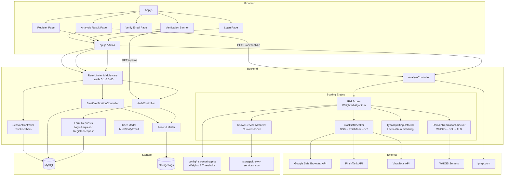

# Design Document: Auth Security Hardening

## Overview

This design covers ten interdependent changes to the authentication system plus a complete overhaul of the URL risk scoring engine. The fixes range from single-line adjustments (token prefix, rate limiting middleware) to multi-component features (multi-signal risk scoring, email verification with frontend UI). The overarching goal is **defense in depth** — each layer (network, application, database, frontend) gets hardened independently while preserving the existing API contract.

### Key Technologies

- **Backend:** Laravel 12, PHP 8.4, MySQL
- **Frontend:** React 19, Axios, React Router 6
- **Auth:** Laravel Sanctum (token-based)
- **Email:** Resend (production), Log driver (dev), Mailpit (Docker)
- **Testing:** PHPUnit (backend), Jest + React Testing Library (frontend)
- **Blocklist APIs:** Google Safe Browsing (free, 10k queries/day), PhishTank (free tier), VirusTotal (free, 500 req/day)
- **Domain WHOIS:** PHP native `fsockopen` to public WHOIS servers
- **SSL Check:** PHP `openssl` extension for certificate validation

### Design Principles

1. **Backward compatibility** — All existing API responses and status codes remain identical. Only new endpoints and behaviors are added.
2. **Defense in depth** — Rate limiting, timing safety, and email verification provide overlapping protections.
3. **Fail safe** — If email sending fails during registration, the user is still created (unverified) rather than blocking registration entirely.
4. **Whitelist over blacklist** — Public routes for the 401 interceptor are explicitly whitelisted, not string-matched.
5. **Graceful degradation** — External APIs (blocklists, WHOIS) can fail without breaking the entire analysis. Missing signals are skipped, scoring continues with available data.
6. **Explainable scores** — Every risk score includes a human-readable breakdown of which factors contributed, so users understand the result.
7. **Weighted multi-signal** — No single signal dominates the score. Multiple inputs are weighted and combined to produce a balanced result.

---

## Architecture

### High-Level Architecture



### Communication/Data Flow

#### Registration Flow (Updated)

1. User submits registration form → `POST /api/register`
2. **Rate limiter** checks IP (max 3 per 60 min) → 429 if exceeded
3. `RegisterRequest` validates: email unique, password complexity
4. `AuthController@register` creates user with `email_verified_at = null`
5. `Illuminate\Auth\Notifications\VerifyEmail` notification sent via Resend
6. Returns `{ token, user }` with HTTP 201

#### Login Flow (Updated)

1. User submits login form → `POST /api/login`
2. **Rate limiter** checks IP (max 5 per 1 min) → 429 if exceeded
3. `LoginRequest` validates: email format, password required
4. `AuthController@login`:
   - Look up user by email
   - **Always** run `Hash::check()` — against stored hash if user found, against dummy hash if not
   - If invalid → generic error
   - If valid → create new token (do **not** delete old ones)
5. Returns `{ token, user }` with HTTP 200

#### Email Verification Flow

1. After registration, Laravel dispatches `VerifyEmail` notification → Resend sends email with signed URL
2. User clicks link → `GET /email/verify/{id}/{hash}` (backend route)
   - If valid + not expired → `email_verified_at = now()` → redirect to frontend `/email/verify?status=success`
   - If invalid/expired → redirect to frontend `/email/verify?status=invalid`
3. User can request resend: `POST /api/email/resend` → throttled 1 per minute

#### Analysis Flow (Updated)

1. User submits target URL → `POST /api/analyze`
2. `AnalyzeController` receives the target
3. `Resolver::resolve($target)` → DNS resolution, type detection, private IP check
4. `IpApiProvider::lookup($resolvedIp)` → geolocation + proxy/hosting flags
5. **NEW** `RiskScorer::score($resolvedIp, $domain)`:
   a. Gather network flags from GeoResult (proxy=25pts, hosting=8pts)
   b. `BlocklistChecker::check($domain, $ip)` → GSB, PhishTank, VirusTotal (async, timeout-safe, gracful failure)
   c. `DomainReputationChecker::check($domain)` → WHOIS age, SSL validity, TLD suspicion
   d. `TyposquattingDetector::check($domain)` → Levenshtein distance against known services
   e. `KnownServicesWhitelist::lookup($domain)` → reputation bonus if found
   f. Combine all signals using configurable weights → 0-100 numeric score
   g. Map to risk level: HIGH (>=65), MEDIUM (>=30), LOW (<30)
   h. Build `risk_breakdown` object explaining each factor
6. Build unified JSON response including `risk_score`, `risk_level`, and `risk_breakdown`
7. (if authenticated) Persist to `lookup_history`

---

## Components and Interfaces

### Backend Components

#### 1. `AuthController` (Modified)

| Method | Change |
|---|---|
| `register()` | Extract validation to `RegisterRequest`. Set `email_verified_at = null`. Send verification notification. |
| `login()` | Extract validation to `LoginRequest`. Use timing-safe comparison. **Remove** `$user->tokens()->delete()`. |
| `me()` | No change (already returns user + `email_verified_at`). |

#### 2. `RegisterRequest` (New)

```php
// app/Http/Requests/RegisterRequest.php
class RegisterRequest extends FormRequest
{
    public function authorize(): true;
    public function rules(): [
        'name'     => ['nullable', 'string', 'max:255'],
        'email'    => ['required', 'email', 'unique:users,email'],
        'password' => ['required', 'string', 'min:8',
                       'regex:/[A-Z]/', 'regex:/[a-z]/',
                       'regex:/[0-9]/', 'regex:/[@$!%*#?&]/'],
    ];
    public function messages(): [
        'password.regex' => 'Password must contain at least one uppercase letter, one lowercase letter, one digit, and one special character.',
    ];
}
```

#### 3. `LoginRequest` (New)

```php
// app/Http/Requests/LoginRequest.php
class LoginRequest extends FormRequest
{
    public function authorize(): true;
    public function rules(): [
        'email'    => ['required', 'email'],
        'password' => ['required', 'string'],
    ];
}
```

#### 4. `EmailVerificationController` (New)

| Endpoint | Method | Purpose |
|---|---|---|
| `GET /email/verify/{id}/{hash}` | `__invoke` | Handle signed URL from email → mark verified |
| `POST /api/email/resend` | `resend` | Resend verification email (throttled) |

#### 5. `SessionController` (New)

| Endpoint | Method | Purpose |
|---|---|---|
| `POST /api/sessions/revoke-others` | `revokeOthers` | Delete all tokens except current |

#### 6. User Model (Updated)

```php
// App\Models\User
// Add MustVerifyEmail interface
class User extends Authenticatable implements MustVerifyEmail
{
    use HasApiTokens, HasFactory, Notifiable;
    // ... existing code (no other changes needed)
}
```

#### 7. Route Changes

```php
// routes/api.php
use App\Http\Controllers\EmailVerificationController;
use App\Http\Controllers\SessionController;

// Public (no auth, no throttle — verification link needs to work)
Route::get('/email/verify/{id}/{hash}', [EmailVerificationController::class, '__invoke'])
    ->name('verification.verify');

Route::middleware(['auth:sanctum'])->group(function () {
    // Existing routes...

    // New
    Route::post('/sessions/revoke-others', [SessionController::class, 'revokeOthers']);
    Route::post('/email/resend', [EmailVerificationController::class, 'resend'])
        ->middleware('throttle:1,1');
});

// Apply rate limiting to login/register
Route::post('/register', [AuthController::class, 'register'])
    ->middleware('throttle:3,60');
Route::post('/login', [AuthController::class, 'login'])
    ->middleware('throttle:5,1');
```

#### 8. Timing-Safe Login Logic

```php
public function login(LoginRequest $request)
{
    $user = User::where('email', $request->email)->first();

    // Timing-safe comparison: always run Hash::check()
    $dummyHash = '$2y$12$' . str_repeat('0', 60); // valid bcrypt hash of empty string

    if (! $user || ! Hash::check($request->password, $user?->password ?? $dummyHash)) {
        throw ValidationException::withMessages([
            'email' => ['The provided credentials are incorrect.'],
        ]);
    }

    $token = $user->createToken('auth-token')->plainTextToken;
    // NOTE: $user->tokens()->delete() removed — multi-device support

    return response()->json([
        'token' => $token,
        'user' => ['id' => $user->id, 'name' => $user->name, 'email' => $user->email],
    ]);
}
```

#### 9. Sanctum Token Prefix

```php
// config/sanctum.php
'token_prefix' => env('SANCTUM_TOKEN_PREFIX', 'lg_'),
```

#### 10. `RiskScorer` (Rewritten)

```php
// app/Services/RiskScorer.php
class RiskScorer
{
    public function __construct(
        private BlocklistChecker $blocklistChecker,
        private DomainReputationChecker $reputationChecker,
        private KnownServicesWhitelist $knownServices,
        private TyposquattingDetector $typosquattingDetector,
    ) {}

    public function score(
        string $domain,
        ?string $resolvedIp,
        ?GeoResult $geo,
    ): RiskScoreResult {
        $weights = config('risk-scoring.weights');
        $score = 0;
        $breakdown = [];

        // 1. Network flags (from geo provider)
        if ($geo && $geo->status === 'success') {
            if ($geo->proxy) {
                $score += $weights['proxy'];
                $breakdown[] = ['factor' => 'proxy', 'contribution' => $weights['proxy'], 'label' => 'Proxy/VPN detected'];
            }
            if ($geo->hosting) {
                $score += $weights['hosting'];
                $breakdown[] = ['factor' => 'hosting', 'contribution' => $weights['hosting'], 'label' => 'Datacenter/hosting IP'];
            }
        }

        // 2. Blocklist checks (graceful on failure)
        try {
            $blocklistResult = $this->blocklistChecker->check($domain, $resolvedIp);
            if ($blocklistResult->found) {
                $score += $weights['on_blocklist'];
                $breakdown[] = ['factor' => 'blocklist', 'contribution' => $weights['on_blocklist'], 'label' => "Found on: " . implode(', ', $blocklistResult->sources)];
            }
        } catch (\Exception $e) {
            Log::warning('Blocklist check failed', ['domain' => $domain, 'error' => $e->getMessage()]);
        }

        // 3. Domain reputation
        try {
            $reputation = $this->reputationChecker->check($domain);
            if ($reputation->domainAgeDays !== null && $reputation->domainAgeDays < 7) {
                $score += $weights['domain_age_under_7_days'];
                $breakdown[] = ['factor' => 'domain_age', 'contribution' => $weights['domain_age_under_7_days'], 'label' => "Domain registered {$reputation->domainAgeDays} days ago"];
            } elseif ($reputation->domainAgeDays !== null && $reputation->domainAgeDays < 30) {
                $score += $weights['domain_age_under_30_days'];
                $breakdown[] = ['factor' => 'domain_age', 'contribution' => $weights['domain_age_under_30_days'], 'label' => "Domain registered {$reputation->domainAgeDays} days ago"];
            } elseif ($reputation->domainAgeDays !== null && $reputation->domainAgeDays < 90) {
                $score += $weights['domain_age_under_90_days'];
                $breakdown[] = ['factor' => 'domain_age', 'contribution' => $weights['domain_age_under_90_days'], 'label' => "Domain registered {$reputation->domainAgeDays} days ago"];
            }
            if (!$reputation->sslValid) {
                $score += $weights['no_valid_ssl'];
                $breakdown[] = ['factor' => 'ssl', 'contribution' => $weights['no_valid_ssl'], 'label' => 'No valid SSL certificate'];
            }
            if ($reputation->suspiciousTld) {
                $score += $weights['suspicious_tld'];
                $breakdown[] = ['factor' => 'tld', 'contribution' => $weights['suspicious_tld'], 'label' => "Suspicious TLD: .{$reputation->tld}"];
            }
        } catch (\Exception $e) {
            Log::warning('Domain reputation check failed', ['domain' => $domain, 'error' => $e->getMessage()]);
        }

        // 4. Typosquatting check
        try {
            $squatResult = $this->typosquattingDetector->check($domain);
            if ($squatResult->isSquatting) {
                $score += $weights['typosquatting'];
                $breakdown[] = ['factor' => 'typosquatting', 'contribution' => $weights['typosquatting'], 'label' => "Possible typosquatting of: {$squatResult->targetDomain}"];
            }
        } catch (\Exception $e) {
            Log::warning('Typosquatting check failed', ['domain' => $domain, 'error' => $e->getMessage()]);
        }

        // 5. Known services whitelist (reputation bonus)
        try {
            if ($this->knownServices->isKnown($domain)) {
                $score -= $weights['known_service_bonus'];
                $breakdown[] = ['factor' => 'known_service', 'contribution' => -$weights['known_service_bonus'], 'label' => 'Recognized legitimate service'];
            }
        } catch (\Exception $e) {
            Log::warning('Known services check failed', ['domain' => $domain, 'error' => $e->getMessage()]);
        }

        // Clamp to 0-100
        $score = max(0, min(100, $score));

        // Determine risk level
        $level = match(true) {
            $score >= config('risk-scoring.thresholds.high') => 'HIGH',
            $score >= config('risk-scoring.thresholds.medium') => 'MEDIUM',
            default => 'LOW',
        };

        return new RiskScoreResult($score, $level, $breakdown);
    }
}
```

#### 11. `RiskScoreResult` (New DTO)

```php
// app/Services/RiskScoreResult.php
class RiskScoreResult
{
    public function __construct(
        public int $score,           // 0-100
        public string $level,        // LOW, MEDIUM, HIGH
        public array $breakdown,     // ['factor' => string, 'contribution' => int, 'label' => string][]
    ) {}
}
```

#### 12. `BlocklistChecker` (New Service)

```php
// app/Services/BlocklistChecker.php
class BlocklistChecker
{
    // Checks Google Safe Browsing, PhishTank, and VirusTotal
    // All calls have 5-second timeouts
    // Returns BlocklistResult with found/not found and source names
    // On any failure: logs warning, returns "not found" (graceful degradation)
}
```

#### 13. `BlocklistResult` (New DTO)

```php
// app/Services/BlocklistResult.php
class BlocklistResult
{
    public function __construct(
        public bool $found,
        public array $sources = [],  // ['Google Safe Browsing', 'PhishTank']
    ) {}
}
```

#### 14. `DomainReputationChecker` (New Service)

```php
// app/Services/DomainReputationChecker.php
class DomainReputationChecker
{
    // Checks WHOIS for domain creation date
    // Checks SSL certificate validity via stream context/openssl
    // Checks TLD against suspicious list
    // Returns DomainReputationResult
    // On failure: logs warning, returns nulls (graceful)
}
```

#### 15. `DomainReputationResult` (New DTO)

```php
// app/Services/DomainReputationResult.php
class DomainReputationResult
{
    public function __construct(
        public ?int $domainAgeDays,   // null on lookup failure
        public ?bool $sslValid,       // null on check failure
        public bool $suspiciousTld,
        public string $tld,
    ) {}
}
```

#### 16. `TyposquattingDetector` (New Service)

```php
// app/Services/TyposquattingDetector.php
class TyposquattingDetector
{
    // Compares domain against known services using Levenshtein distance
    // Flag if distance <= 2 and domain != target
    // Returns TyposquattingResult
}
```

#### 17. `TyposquattingResult` (New DTO)

```php
// app/Services/TyposquattingResult.php
class TyposquattingResult
{
    public function __construct(
        public bool $isSquatting,
        public ?string $targetDomain = null,  // Which known domain it resembles
    ) {}
}
```

#### 18. `KnownServicesWhitelist` (New Service)

```php
// app/Services/KnownServicesWhitelist.php
class KnownServicesWhitelist
{
    // Loads known-services.json from storage/
    // Matches domain + all subdomains
    // Exact match and wildcard subdomain support
}
```

#### 19. Config File: `config/risk-scoring.php` (New)

```php
// config/risk-scoring.php
return [
    'weights' => [
        'proxy'                  => 25,   // IP is a known proxy/VPN
        'hosting'                => 8,    // IP is a datacenter/hosting
        'on_blocklist'           => 40,   // Found on GSB, PhishTank, or VirusTotal
        'domain_age_under_7_days'=> 35,   // Domain registered < 7 days ago
        'domain_age_under_30_days'=> 25,  // Domain registered 7-30 days ago
        'domain_age_under_90_days'=> 15,  // Domain registered 30-90 days ago
        'no_valid_ssl'           => 20,   // No valid SSL certificate
        'suspicious_tld'         => 10,   // .xyz, .top, .gq, .ml, .tk, etc.
        'typosquatting'          => 35,   // Levenshtein match against known services
        'known_service_bonus'    => 30,   // Reputation bonus for known legitimate services
    ],
    'thresholds' => [
        'high'   => 65,  // >= 65 → HIGH
        'medium' => 30,  // >= 30 → MEDIUM, < 65
        // < 30 → LOW
    ],
    'blocklist' => [
        'google_safe_browsing' => [
            'enabled' => env('GSB_ENABLED', false),
            'api_key' => env('GSB_API_KEY'),
            'timeout' => 5,
        ],
        'phishtank' => [
            'enabled' => env('PHISHTANK_ENABLED', false),
            'api_key' => env('PHISHTANK_API_KEY'),
            'timeout' => 5,
        ],
        'virustotal' => [
            'enabled' => env('VIRUSTOTAL_ENABLED', false),
            'api_key' => env('VIRUSTOTAL_API_KEY'),
            'timeout' => 5,
        ],
    ],
    'whois' => [
        'timeout' => 10,  // WHOIS lookups can be slow
    ],
];
```

#### 20. Known Services Whitelist File: `storage/known-services.json`

```json
[
  "github.com",
  "gitlab.com",
  "bitbucket.org",
  "google.com",
  "youtube.com",
  "facebook.com",
  "twitter.com",
  "x.com",
  "linkedin.com",
  "reddit.com",
  "stackoverflow.com",
  "medium.com",
  "notion.so",
  "linear.app",
  "slack.com",
  "discord.com",
  "zoom.us",
  "microsoft.com",
  "apple.com",
  "amazon.com",
  "aws.amazon.com",
  "vercel.com",
  "netlify.com",
  "heroku.com",
  "railway.app",
  "fly.io",
  "render.com",
  "resend.com",
  "sendgrid.com",
  "mailgun.com",
  "postmarkapp.com",
  "mailtrap.io",
  "stripe.com",
  "cloudflare.com",
  "digitalocean.com",
  "linode.com",
  "ovh.com",
  "namecheap.com",
  "godaddy.com",
  "cloud.google.com",
  "azure.microsoft.com",
  "mysql.com",
  "laravel.com",
  "php.net",
  "npmjs.com",
  "docker.com",
  "kubernetes.io",
  "terraform.io",
  "auth0.com",
  "okta.com"
]
```

#### 21. Updated Analysis Response Format

```json
{
  "target": "resend.com",
  "type": "domain",
  "resolved_ip": "76.76.21.21",
  "geo": {
    "query": "76.76.21.21",
    "status": "success",
    "country": "United States",
    "countryCode": "US",
    "isp": "Vercel Inc.",
    "hosting": true,
    "proxy": false
  },
  "risk_score": 8,
  "risk_level": "LOW",
  "risk_breakdown": [
    {"factor": "hosting", "contribution": 8, "label": "Datacenter/hosting IP"},
    {"factor": "known_service", "contribution": -30, "label": "Recognized legitimate service"},
    {"factor": "ssl", "contribution": 0, "label": "Valid SSL certificate"},
    {"factor": "domain_age", "contribution": 0, "label": "Domain registered 1360 days ago"}
  ],
  "dns_records": [
    {"type": "A", "host": "resend.com", "ip": "76.76.21.21"}
  ]
}
```

### Frontend Components

#### 1. `api.js` — Updated 401 Interceptor

```javascript
const PUBLIC_ENDPOINTS = [
    '/api/login',
    '/api/register',
    '/email/verify/',  // starts with — verification links
];

api.interceptors.response.use(
    (response) => response,
    (error) => {
        if (error.response?.status === 401) {
            const url = error.config?.url || '';
            const isPublic = PUBLIC_ENDPOINTS.some(endpoint =>
                endpoint.endsWith('/') ? url.startsWith(endpoint) : url === endpoint
            );
            if (!isPublic) {
                localStorage.removeItem('auth_token');
                localStorage.removeItem('session_start');
                window.dispatchEvent(new CustomEvent('auth:session-expired'));
            }
        }
        return Promise.reject(error);
    }
);
```

#### 2. `VerificationBanner.js` (New Component)

- **Shown when:** user is logged in AND `user.email_verified_at === null`
- **Position:** Fixed top banner, below the session-warning banner
- **Content:** "Please verify your email address. [Resend verification email]"
- **Resend behavior:** calls `POST /api/email/resend`, shows success/error toast
- **Disappears:** on next `GET /api/me` response where `email_verified_at` is non-null

#### 3. `VerifyEmail.js` (New Page)

- **Route:** `/email/verify?status=success` and `/email/verify?status=invalid`
- **Success page:** "Email verified! Redirecting to dashboard..." → auto-redirect 3s to `/home`
- **Invalid page:** "Verification link expired or invalid. [Request new link]" → button calls resend endpoint

#### 4. `Register.js` — Post-Registration Notice

- After successful registration, show inline notice: "Account created! Please check your email to verify your account."
- This replaces the immediate redirect to `/home` with a 3-second delay showing the notice, then redirect.

---

## Data Models

### Schema Changes

**No new tables needed.** All email verification uses existing columns and Laravel's built-in `email_verified_at` field.

```sql
-- Already exists in users table:
-- email_verified_at TIMESTAMP NULL (already nullable)

-- No migration changes required for the schema
```

### TypeScript Types

```typescript
// Updated User type
export interface User {
  id: number;
  name: string | null;
  email: string;
  email_verified_at: string | null;  // ISO date string or null
}

// Updated auth response
export interface AuthResponse {
  token: string;
  user: User;
}

// API /me response
export interface MeResponse {
  authenticated: boolean;
  user?: User;
}

// Verification status responses
export interface VerifySuccessResponse {
  message: string;
  verified: boolean;
}
```

---

## Correctness Properties

### Property 1: Timing-Safe Login

*For any* email `e` (registered or not), the response time of `POST /api/login` SHALL NOT differ by more than observable network jitter.

**Validates:** Requirements 1.1, 1.2, 1.3

### Property 2: Rate Limit Enforcement

*For any* IP address `i`, after `n` failed login attempts in `t` seconds where `n > limit`, the response SHALL be HTTP 429.

**Validates:** Requirements 2.1, 2.2, 2.3

### Property 3: Multi-Device Persistence

*For any* user `u` with existing valid tokens `T = {t1, t2, ..., tn}`, after a successful login, `u` SHALL have `n+1` valid tokens.

**Validates:** Requirements 3.1

### Property 4: Session Revocation Isolation

*For any* authenticated request using token `ti`, calling `POST /api/sessions/revoke-others` SHALL delete all tokens except `ti`.

**Validates:** Requirements 3.2, 3.3

### Property 5: 401 Interceptor Whitelist

*For any* URL `u` in the public whitelist, a 401 response SHALL NOT trigger session cleanup.

**Validates:** Requirements 4.1, 4.2, 4.3

### Property 6: Token Prefix

*Any* newly created Sanctum token SHALL match the pattern `lg_\d+\|[a-f0-9]{64}`.

**Validates:** Requirements 5.1

### Property 7: Email Verification State

*For any* newly registered user `u`, `u.email_verified_at` SHALL be `null`.

*For any* user `u` who clicks a valid verification link, `u.email_verified_at` SHALL be a non-null timestamp.

**Validates:** Requirements 6.1, 6.2, 6.3, 6.4

### Property 8: Password Complexity

*For any* password `p` shorter than 8 characters, or missing any required character class, validation SHALL fail with a descriptive error.

**Validates:** Requirements 9.1, 9.2

### Property 9: Regression — Existing Auth Flow

*For any* valid login or registration request, the response SHALL contain a `token` and `user` field identical in structure to the pre-fix API.

**Validates:** RP.1, RP.2, RP.3, RP.4, RP.5

### Property 10: Multi-Signal Scoring Completeness

*For any* analysis request with a resolvable target, the risk score SHALL be computed from at least 3 signal categories (network, reputation, blocklist, or whitelist), never from a single flag alone.

**Validates:** Requirements 11.1

### Property 11: Known Service Bonus

*For any* domain `d` in the known services whitelist, the risk score SHALL be reduced by the `known_service_bonus` weight (default 30), ensuring well-known services never exceed MEDIUM.

**Validates:** Requirements 11.2

### Property 12: Blocklist Elevation

*For any* domain `d` found on ANY configured blocklist, the risk score SHALL be at least the `high` threshold (default 65), ensuring a minimum HIGH risk level.

**Validates:** Requirements 11.3, 11.4

### Property 13: Graceful Degradation

*For any* analysis request where ALL external APIs (blocklist, WHOIS) time out, the system SHALL still return a valid risk score using only the available signals (geo + local checks), and SHALL NOT return an error.

**Validates:** Requirements 11.11

### Property 14: Explainable Breakdown

*For any* analysis response, the `risk_breakdown` array SHALL contain at least one entry per signal that contributed (positively or negatively) to the final score, with a human-readable label.

**Validates:** Requirements 11.12

---

## Error Handling

| Scenario | HTTP Status | Response Body | User Feedback |
|---|---|---|---|
| Login rate limited | 429 | `{"message": "Too many login attempts. Try again in 60 seconds."}` | "Too many attempts. Please wait before trying again." |
| Register rate limited | 429 | `{"message": "Too many registration attempts. Try again later."}` | "Too many attempts. Please try again later." |
| Invalid credentials (timing-safe) | 422 | `{"message": "The provided credentials are incorrect.", "errors": {"email": ["..."]}}` | "Invalid credentials, please try again." |
| Password too weak | 422 | `{"message": "...", "errors": {"password": ["..."]}}` | Specific messages per missing complexity rule |
| Email already verified | 400 | `{"message": "Email already verified."}` | "Your email is already verified." |
| Invalid verification link | 400 | `{"message": "Invalid verification link."}` | "This verification link is invalid or has expired." |
| Resend throttled | 429 | `{"message": "Please wait before requesting another email."}` | "Please wait a minute before requesting again." |
| Blocklist API timeout | 200 (with data) | Score computed without blocklist signal, `risk_breakdown` notes "Blocklist check unavailable" | "Risk analysis complete (partial data)" |
| WHOIS lookup failure | 200 (with data) | Score computed without domain age signal | "Risk analysis complete (partial data)" |

---

## Testing Strategy

### Backend Unit Tests

| Test | File | Validates |
|---|---|---|
| Login timing: non-existent email + dummy hash | `tests/Unit/Auth/TimingSafeLoginTest.php` | Req 1.1 |
| Login timing: wrong password | `tests/Unit/Auth/TimingSafeLoginTest.php` | Req 1.2 |
| Password validation: all complexity rules | `tests/Unit/Auth/PasswordValidationTest.php` | Req 9.1, 9.2 |
| Token prefix format | `tests/Unit/Auth/TokenPrefixTest.php` | Req 5.1 |
| RiskScorer: proxy → HIGH | `tests/Unit/Risk/RiskScorerTest.php` | Req 11.1 |
| RiskScorer: hosting only → LOW (with known service bonus) | `tests/Unit/Risk/RiskScorerTest.php` | Req 11.2 |
| RiskScorer: young domain adds score | `tests/Unit/Risk/RiskScorerTest.php` | Req 11.5 |
| RiskScorer: no SSL adds score | `tests/Unit/Risk/RiskScorerTest.php` | Req 11.6 |
| RiskScorer: suspicious TLD adds score | `tests/Unit/Risk/RiskScorerTest.php` | Req 11.7 |
| RiskScorer: typosquatting detection | `tests/Unit/Risk/RiskScorerTest.php` | Req 11.8 |
| RiskScorer: known service gets LOW | `tests/Unit/Risk/RiskScorerTest.php` | Req 11.9 |
| RiskScorer: graceful degradation on API failure | `tests/Unit/Risk/RiskScorerTest.php` | Req 11.11 |
| RiskScorer: breakdown contains all contributing factors | `tests/Unit/Risk/RiskScorerTest.php` | Req 11.12 |
| TyposquattingDetector: exact match | `tests/Unit/Risk/TyposquattingDetectorTest.php` | Req 11.8 |
| TyposquattingDetector: Levenshtein distance | `tests/Unit/Risk/TyposquattingDetectorTest.php` | Req 11.8 |
| DomainReputationChecker: SSL validation | `tests/Unit/Risk/DomainReputationCheckerTest.php` | Req 11.6 |
| DomainReputationChecker: suspicious TLD list | `tests/Unit/Risk/DomainReputationCheckerTest.php` | Req 11.7 |
| KnownServicesWhitelist: match and subdomain | `tests/Unit/Risk/KnownServicesWhitelistTest.php` | Req 11.2 |

### Backend Feature (Integration) Tests

| Test | File | Validates |
|---|---|---|
| Login rate limit triggered | `tests/Feature/Auth/RateLimitTest.php` | Req 2.1 |
| Register rate limit triggered | `tests/Feature/Auth/RateLimitTest.php` | Req 2.2 |
| Multiple logins keep old tokens | `tests/Feature/Auth/MultiDeviceTest.php` | Req 3.1 |
| Revoke others preserves current token | `tests/Feature/Auth/RevokeOthersTest.php` | Req 3.2, 3.3 |
| Registration creates unverified user | `tests/Feature/Auth/EmailVerificationTest.php` | Req 6.1 |
| Verification link marks verified | `tests/Feature/Auth/EmailVerificationTest.php` | Req 6.2, 6.3 |
| Invalid verification link rejected | `tests/Feature/Auth/EmailVerificationTest.php` | Req 6.4 |
| Resend verification throttled | `tests/Feature/Auth/EmailVerificationTest.php` | Req 6.5 |
| Registration with invalid password returns 422 | `tests/Feature/Auth/RegisterValidationTest.php` | Req 9.1 |
| Registration with valid data returns 201 | `tests/Feature/Auth/RegisterValidationTest.php` | RP.1 |
| Login with valid credentials returns 200 | `tests/Feature/Auth/LoginTest.php` | RP.2 |
| Existing logout still works | `tests/Feature/Auth/LogoutTest.php` | RP.4 |
| Analysis with risk breakdown in response | `tests/Feature/Risk/AnalyzeRiskBreakdownTest.php` | Req 11.12 |
| Analysis with blocklist API failure returns score | `tests/Feature/Risk/AnalyzeGracefulDegradationTest.php` | Req 11.11 |
| Analysis of known service returns LOW | `tests/Feature/Risk/AnalyzeKnownServiceTest.php` | Req 11.2, 11.9 |

### Frontend Tests

| Test | File | Validates |
|---|---|---|
| 401 interceptor whitelist check | `src/__tests__/api.test.js` | Req 4.1, 4.2, 4.3 |
| Verification banner renders when unverified | `src/__tests__/VerificationBanner.test.js` | Req 8.2 |
| Verification banner hidden when verified | `src/__tests__/VerificationBanner.test.js` | Req 8.5 |
| Resend button calls correct endpoint | `src/__tests__/VerificationBanner.test.js` | Req 8.3 |
| Verify email success page renders | `src/__tests__/VerifyEmail.test.js` | Req 8.4 |
| Verify email invalid page renders | `src/__tests__/VerifyEmail.test.js` | Req 8.4 |
| Post-registration notice shown | `src/__tests__/Register.test.js` | Req 8.1 |

### Property-Based Testing Applicability

**Assessment:** APPLICABLE — strongly

**Rationale:**

- **RiskScorer weighted algorithm** — A PBT could generate random combinations of signals (proxy true/false, hosting true/false, domain ages from 1-5000 days, SSL valid/invalid, blocklist found/not found, known service/not) and verify that:
  - The score is always in range [0, 100]
  - The risk level is consistent with the score
  - The breakdown sum equals the total score
  - Known services never exceed the MEDIUM threshold
  - Blocklisted domains always meet the HIGH threshold
- **TyposquattingDetector** — A PBT could generate random typos of known domains and verify detection
- **Password complexity** — A PBT could generate thousands of random password strings and verify that the validator rejects all that fail the policy and accepts all that pass
